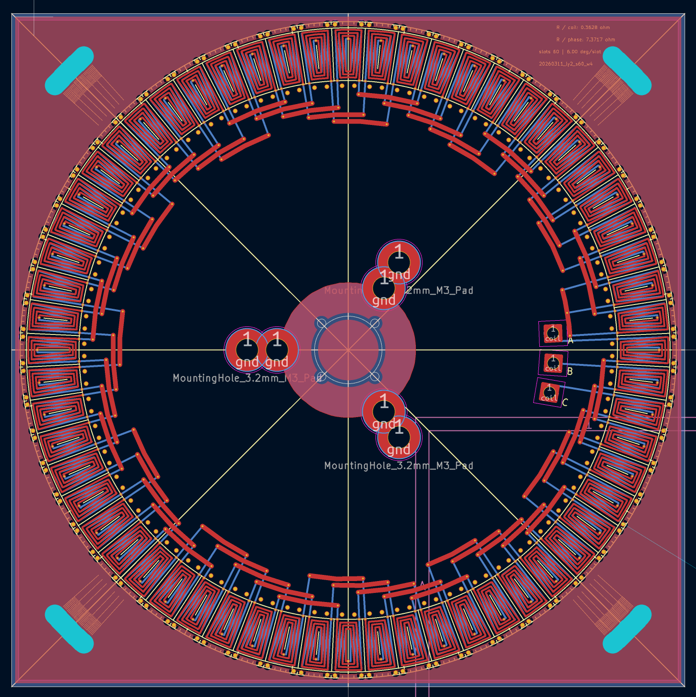

# KMotor_Pro

Current KiCad 9 GPL fork of KiMotor with deterministic PCB motor generation, extended stats, fabrication presets and a second magnet-PCB workflow.

## Credits

- Original KiMotor concept and base implementation: Stefano Cottafavi
- Fork, UI overhaul, routing fixes, silkscreen/alignment helpers and ongoing development: I-T-C-R-W

## Current Feature Set

- Radial coil generation remains the default stable path.
- `Parallel`, `Radial` and `Compact` coil style controls are available.
- `maxSpec layout` can switch dense / near-square slot setups to the compact workflow.
- Optional `PCB` / `Wire` winding mode for stats derivation.
- Fabrication presets for common JLCPCB and PCBWay setups.
- `Generate Magnet PCB` and `Generate Both` create a second board with shared mechanics.
- Corner alignment helpers generate NPTH hole arrays plus angular silkscreen scales.
- Terminal references and board info text are placed deterministically.
- Generated GND and mask zones are replaced without deleting unrelated board zones.

## Physics / Stats

- Total, phase, coil and ring resistance
- Total copper length
- Turns per layer estimate
- `Ke est`, `Kt est`, `Kv est`
- Winding factor estimate
- No-load RPM @ 12V estimate
- Stall current and stall torque estimates

All higher-level motor values are currently shown explicitly as estimates.

## Mechanical / Layout Improvements

- Safer geometry and intersection handling for vertical and near-vertical cases
- Deterministic slot anchor placement
- Deterministic center-via placement in the tested low-height edge cases
- Support TH / support via handling with collision checks
- KiCad 9 footprint directory detection via version-aware variables such as `KICAD9_FOOTPRINT_DIR`
- GUI layout cleanup and equalized column scaling
- Status panel with `Ready`, `Running`, `Finished` and `Failed`

## Scope / Status

- `3P` is the primary stable target
- `1P` is improved and usable
- `3P+N` still needs a final dedicated neutral-routing topology
- `Compact` is currently a stable workflow/UI mode; its dedicated final geometry solver is still being expanded

## Next Steps

- predefined compact / maxSpec coil geometries
- further magnet-PCB production geometry
- richer derived motor stats
- later API-oriented deterministic engine extraction
