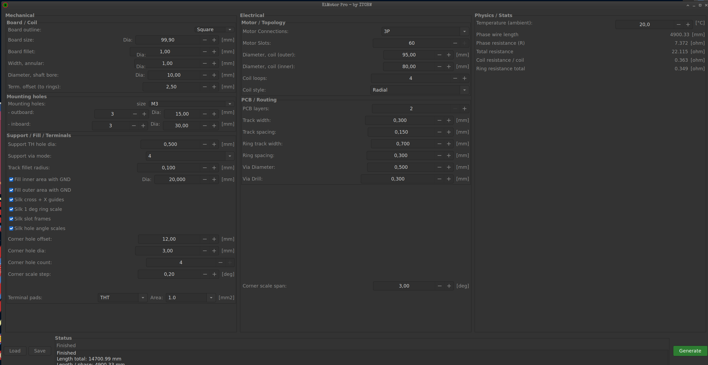

# KMotor_Pro

GPL-2.0-only fork of KiMotor by Stefano Cottafavi, continued and extended as `KMotor_Pro` by I-T-C-R-W.

## Credits

- Original KiMotor concept and base implementation: Stefano Cottafavi
- Fork, UI overhaul, routing fixes, deterministic silkscreen/alignment helpers and ongoing development: I-T-C-R-W

## First Release Scope

- Radial coil generation is the default path.
- KiCad 9 footprint directory detection uses version-aware variables such as `KICAD9_FOOTPRINT_DIR`.
- Generated GND and mask zones are replaced without deleting unrelated board zones.
- Terminal references and board info text are placed deterministically.
- Phase, coil and ring resistance values are calculated and shown in the GUI and on-board silkscreen.
- Optional corner alignment helpers generate NPTH hole arrays plus silkscreen scale lines.
- Square boards can use corner offset, hole diameter, scale step and span for repeatable angular alignment.

## Included Improvements

- Safer geometry and intersection handling for vertical and near-vertical cases.
- Deterministic slot anchor and center-via placement.
- Support TH / support via handling with collision checks.
- GUI layout cleanup and equalized column scaling.
- Status panel with `Ready`, `Running`, `Finished` and `Failed`.
- Expanded stats output for total, phase, coil and ring resistance.

## Current Focus

- `3P` is the primary stable target for this first release.
- `1P` is improved and usable.
- `3P+N` still needs a dedicated final neutral-routing topology.

## Notes

- `3P+N` Terminal-/Neutral-Topologie ist noch nicht final:
  - N-Positionierung und Endrouting benötigen noch eine dedizierte, vollständig deterministische Topologie-Tabelle.
- The hidden PCB preset code remains in place for compatibility, but is not yet an active GUI feature.
- This release is meant as the stable baseline for the next stage: API access, deterministic engine extraction and broader design-space exploration.
